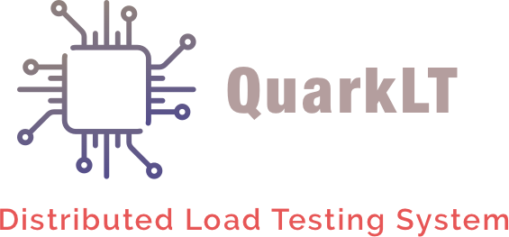

## Система автоматизированного нагрузочного тестирования веб-серверов

## Установка системы

## Установка из Quark-LT через **Go** get
```bash
go get "github.com/vinogradnick/quark-lt"
glide install
```
## Установка Ubuntu
1. Скачать архив для установки 
[Релизы QuarkLT](https://github.com/vinogradnick/quark-lt/releases)
2. Скачать InfluxDb [InfluxDB](https://www.influxdata.com/)
3. Скачать Grafana-Server [Grafana](https://grafana.com/get)


## Установка Windows
1. Скачать архив QuarkApiServer.exe [Релизы QuarkLT](https://github.com/vinogradnick/quark-lt/releases)
2. Скачать InfluxDb [InfluxDB](https://www.influxdata.com/)
3. Скачать Grafana-Server [Grafana](https://grafana.com/get)
4. PostgreSql при желании

###! Примечание
**Запуск рабочих узлов QuarkNode не доступен на Windows** в силу ограничения системы:((


## Запуск системы

### Главный сервер управления тестированием QuarkApiServer
Исполняемый файл quark-apiserver.exe || quark-apiserver

Конфигурация Quark-ApiServer представлена ниже

### Узел системы QuarkNode
Исполняемый файл quark-node

Конфигурация QuarkNode представлена ниже

# Рабочий системы QuarkWorker
Исполняемый файл quark_worker запуск не требуется в случае запуска в формате комплекса

Конфигурация QuarkWorker не требуется в случае запуска в формате комплекса

### Примечание
Можно использовать рабочего системы **QuarkWorker** отдельно от всей системы и использовать для тестирования
Необходимо указать в конфигурации в пути к **InfluxDB**  [Ссылка на скачивание InfluxDB](https://www.influxdata.com/)


## DockerCompose
Также можно запустить систему в формате контейнеров через  DockerCompose

Конфигурация запуска представлена ниже

```dockerfile

```

## Конфигурации


### Конфигурация узла системы QuarkNode

```yaml
name: "node-1"
uuid: "fdksfldsflsdklfds"
databaseurl: "http://localhost:8086"
serverconfig:
  host: "localhost"
  port: 7777
masterhosturl: "http://localhost:7700"
```

### Конфигурация главного сервера Quark-ApiServer

```yaml
host: localhost
port: 7700
influxurl: http://localhost:8086
databaseconfig:
  host: "localhost"
  port: 7700
  user: "root"
  password: "root"
  databasename: "quarklt"
  databasetype: "sqlite"

```


### Пример конфигурации тестирования
```yaml
config:
    routing:
      - roadmap:
          url: "http://localhost"
          requestType: GET
          context: application/json
          statusCode: 200
    step-load:
      start: 1
      end: 10
      duration: 2min
      step: 1
```


```json
{
  "config": {
    "name": "gl.m,,.nm,n,n,n,nm,",
    "server-host": "dsadsadsa",
    "site-setup": {
      "schedules": [
        {
          "routing": [
            {
              "url": "http://localhost:1488",
              "context": "",
              "statusCode": 200,
              "requestType": "GET"
            }
          ],
          "exp-load": {
            "value": 120,
            "duration": "4s"
          },
          "const-load": null,
          "line-load": null,

          "Stress": null,
          "Performance": null
        }
      ],
      "helpers": {
        "ssh-agent": {
          "host": "",
          "user": "",
          "port": 0,
          "auth-method": null
        }
      },
      "auto-stop": null
    }
  },
  "server_config": {
    "host": "localhost",
    "port": 7777
  },
  "database_url": "http://localhost:8086"
}
```