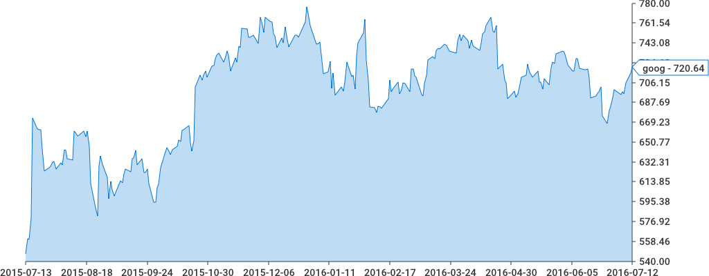
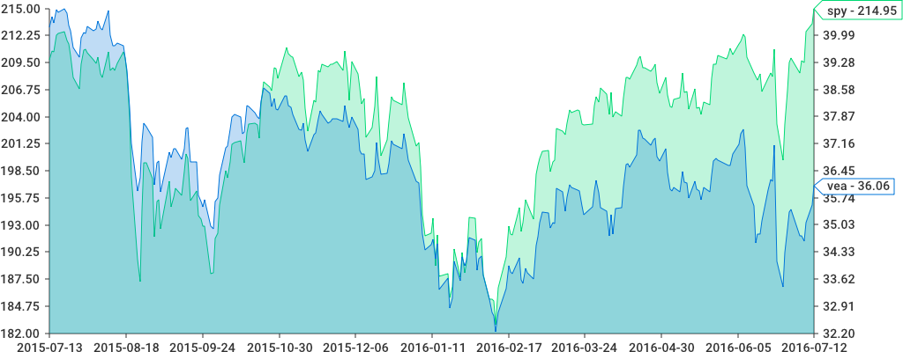

  

# **Отчет по тестированию**


## Назначение документа
 
**Основная  цель  данного  документа**  –  предоставить  обработанные  и 
систематизированные  результаты  нагрузочного  тестирования  **Веб-сервера [Имя Веб-Сервера]**,  описать 
отклонения  при  проведении  тестирования  от  методики  и  ограничения 
тестирования. 

## Основные положения

**Основной  целью  проведения  нагрузочного  тестирования**  **Веб-сервера [Имя Веб-Сервера]**  является 
оценка  возможностей  системы. 

Для  определения  производительности  **Веб-сервера [Имя Веб-Сервера]**
планируется: 

1. Определение максимальной производительности (количество запросов/час) 
Веб-сервера [Имя Веб-Сервера] ,  на  существующей  конфигурации  (в  соответствии  с  настроенными 
правилами). 
2. Проверка  надежности  **Веб-сервера [Имя Веб-Сервера]**  во  время  тестирования  в  течение  длительного 
времени. 
3. Определить  отказоустойчивость  **Веб-сервера [Имя Веб-Сервера]**  при  отказе  одной  из  площадок 
серверов приложения (останов 2-х из 4-х серверов приложения) 
4. Выявление потенциально «узких» мест **Веб-сервера [Имя Веб-Сервера]**. 

### Методика тестирования
Для тестирования использовался шаговой алгоритм тестирования в течении 20 минут.

### Конфигурация тестирования
```yaml
name: quarkload
server-host: localhost
site-setup:
  schedules:
    - schedule:
        routing:
          - roadmap:
              url: "http://localhost"
              requestType: GET
              context: application/json
              statusCode: 200
          - roadmap:
        step-load:
          start: 1
          end: 10
          duration: 2min
          step: 1
  autostop:
    quantile: 90%
    responseLimit: 10ms
    time: 1h
  helpers:
    ssh-agent:
      host: {{ HASHICORP.SSH_HOST }}
      user: {{ HASHICORP.SSH_USER }}
      port: 22
      auth-method:
        user-auth:
          password: {{ HASHICORP.SSH_PASSWORD }}
```
### Ограничение тестирования

Ограничений тестирования нет.

## Выводы 

#### Показатели тестирования

**Requests Per Second** --  _10 (rps)_

**Query Per Second** --     _10 (qps)_

**Average ResponseTime** -- _1.2 (ms)_

**Max ResponseTime** --     _5.1 (ms)_

**Min ResponseTime** --     _0.6 (ms)_

#### Системные метрики

**CpuLoad** --                 _30(%)_

**MemoryFree** --              _8300(Mb)_

**MemoryCached** --            _3500(Mb)_

**DiskLoad (IO interface)** -- _50(%)_

### График тестирования
  
#### Зависимость числа запросов от используемой  памяти
  
